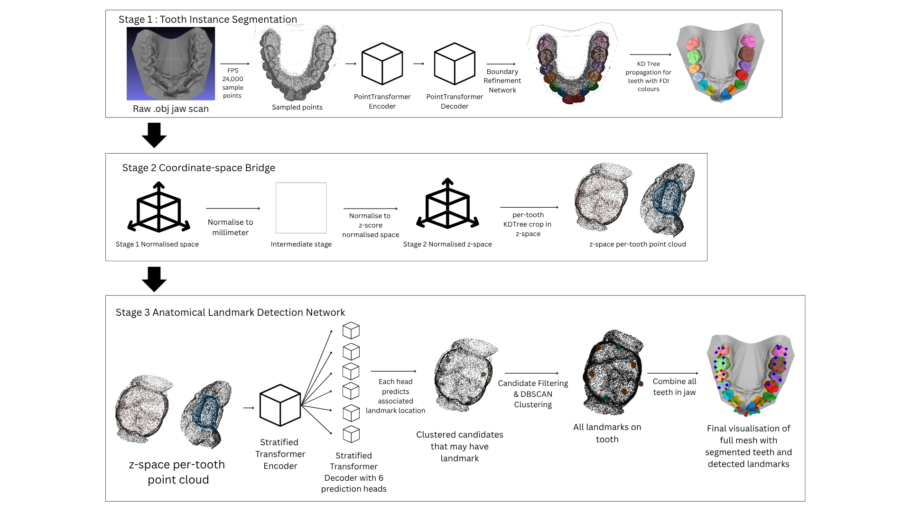
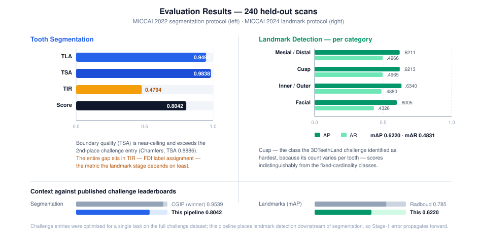
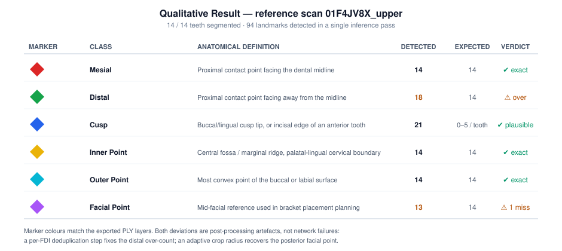

# Automated Tooth Segmentation & Anatomical Landmark Detection Deep Learning Pipeline

**Project No.** CCDS25-0544 · **Degree** B.Eng. (Computer Engineering) · **AY** 2025/2026
**Author** Nathaniel Lo Tzin Ye · **Supervisor** Prof. Zheng Jianmin,
College of Computing & Data Science, Nanyang Technological University, Singapore

📄 **Publication (NTU Digital Repository):** https://dr.ntu.edu.sg/entities/publication/9c514406-141c-4615-8594-8c4bc19be852

<p align="center">
  
</p>

---

## 1. Overview

Three-dimensional intraoral scanning is now standard practice in orthodontics, but the
downstream analysis — identifying every tooth and placing anatomical reference points on each
crown — is still performed by hand. It is slow, expertise-dependent, and subject to
inter-examiner variability.

This project delivers a **fully automated, end-to-end deep learning pipeline** that takes a
single raw jaw scan (`.obj`) and returns, with no manual intervention beyond scan acquisition:

1. a **per-vertex FDI tooth label** for every point of the mesh (up to 16 teeth + gingiva), and
2. the **3D coordinates of six anatomical landmark classes** for every segmented tooth, with
   confidence scores and the FDI number of the tooth each landmark belongs to.

The central technical contribution is a **coordinate-space bridge** that reconciles two
independently trained networks — one trained in a Y-range-normalised space (Teeth3DS /
3DTeethSeg'22), the other in a z-score-normalised space (3DTeethLand / MICCAI 2024) — so that
they operate as one coherent system rather than two disconnected models.


### Landmark classes

| Class | Anatomical definition | Expected count / tooth |
|---|---|---|
| **Mesial** | Contact point on the proximal surface facing the dental midline | 1 |
| **Distal** | Contact point on the proximal surface facing away from the midline | 1 |
| **Cusp** | Tip of a buccal/lingual cusp, or the incisal edge of an anterior tooth | 0 (incisors), 1–2 (premolars), 2–5 (molars) |
| **Inner Point** | Deepest point of the central fossa / most prominent marginal ridge (palatal-lingual side) | 1 |
| **Outer Point** | Most convex point of the buccal or labial surface | 1 |
| **Facial Point** | Mid-facial surface reference used in bracket placement planning | 1 |

---

## 2. Key Achievements

- **A working end-to-end system.** Raw `.obj` in → FDI-labelled mesh, landmark JSON, and eight
  colour-coded PLY visualisation layers out, in a single inference pass.
- **Near-ceiling segmentation boundary quality:** **TSA 0.9838** (micro-F1) and
  **TLA 0.9492** on 240 held-out Teeth3DS scans, with a **combined 3DTeethSeg'22 challenge
  score of 0.8042**.
- **Competitive landmark detection from a *downstream* position:** **mAP 0.6220 / mAR 0.4831**
  across all six landmark classes on 240 scans — achieved with landmark detection sitting behind
  a segmentation stage whose errors propagate forward, versus challenge entries optimised for
  landmark detection alone on the full challenge dataset.
- **Cusp detection solved as reliably as the fixed-cardinality classes.** Cusps were the class
  the 3DTeethLand challenge identified as hardest (variable count per tooth), yet this pipeline
  reaches **AP 0.6213 / AR 0.4965** for cusps — statistically indistinguishable from the
  Mesial/Distal pair (AP 0.6211) — by combining a dedicated variable-output head with
  count-agnostic DBSCAN clustering.
- **A novel, documented coordinate-space bridge** (`pipeline/data_bridge.py`) that makes two
  networks trained under incompatible normalisation conventions interoperable — the enabling
  contribution without which the pipeline could not exist.
- **Qualitatively correct anatomy.** On the reference scan `01F4JV8X_upper`, all 14 teeth were
  segmented with clean inter-tooth boundaries and 94 landmarks were detected, with Mesial,
  InnerPoint and OuterPoint each hitting the expected count of exactly 14 and placed on the
  anatomically correct surfaces.

---

## 3. Results

<p align="center">
  
</p>

> A detailed walkthrough of every metric, the per-class breakdown, and the failure analysis is in
> **[docs/RESULTS.md](docs/RESULTS.md)**.

### 3.1 Quantitative — 240 held-out scans

| Task | Metric | Score |
|---|---|---|
| **Tooth Segmentation** (MICCAI 2022 protocol) | TLA (exp-norm ↑) | **0.9492** ± 0.2178 |
| | TSA (micro-F1 ↑) | **0.9838** ± 0.0098 |
| | TIR (% ↑) | 0.4794 ± 0.4866 |
| | **Challenge Score** | **0.8042** |
| **Landmark Detection** (MICCAI 2024 protocol) | mAP ↑ | **0.6220** |
| | mAR ↑ | **0.4831** |

Per-category landmark breakdown:

| Category | AP | AR |
|---|---|---|
| Mesial / Distal | 0.6211 | 0.4966 |
| Cusp | 0.6213 | 0.4965 |
| Inner / Outer | 0.6340 | 0.4880 |
| Facial | 0.6005 | 0.4326 |

Reproduce with:

```bat
python eval_miccai.py --max-scans 240
```

> **Reproducibility note.** The figures above are the ones published in the FYP report. The
> post-processing in `pipeline/landmark_postprocess.py` has since gained per-head thresholds and
> a two-means Mesial/Distal separation step (see
> [`FIX_MESIAL_DISTAL_LANDMARKS.md`](dental_landmark_pipeline/FIX_MESIAL_DISTAL_LANDMARKS.md)),
> so a fresh run will not reproduce the report's numbers exactly. `results/eval_full.json` holds
> an intermediate run and does **not** match the report — re-run `eval_miccai.py` to regenerate
> current figures.

### 3.2 Context against the published challenge leaderboards

| System | Task | Result |
|---|---|---|
| CGIP (Lim et al.), 3DTeethSeg'22 winner | Segmentation | Score 0.9539 |
| **This pipeline** | Segmentation | **Score 0.8042** (TSA 0.9838 ≫ Chamfers' 0.8886) |
| Radboud (van Nistelrooij et al.), 3DTeethLand winner | Landmarks | mAP 0.785 / mAR 0.656 |
| ChohoTech, 2nd | Landmarks | mAP 0.775 |
| **This pipeline** | Landmarks | **mAP 0.6220 / mAR 0.4831** |

The segmentation gap is concentrated entirely in **TIR (0.4794)** — FDI *label assignment*, not
localisation or boundary quality. This is the metric every 3DTeethSeg'22 entrant found hardest,
and it is driven by class imbalance: only ~5 % of Teeth3DS scans contain wisdom teeth. Critically,
TIR is the metric this pipeline depends on least: the landmark stage consumes per-tooth
*geometric crops*, not FDI semantics, so a mislabelled-but-well-segmented tooth still yields
correct landmarks. Boundary quality (TSA), which the landmark stage *does* depend on, is where
the pipeline is strongest.

### 3.3 Qualitative — reference scan `01F4JV8X_upper`

<p align="center">
  
</p>

14/14 teeth segmented and colour-coded; **94 landmarks** detected in one pass:

| Class | Detected | Expected | Assessment |
|---|---|---|---|
| Mesial | 14 | 14 | Exact; correctly on midline-facing proximal surfaces |
| Inner Point | 14 | 14 | Exact; traces a smooth palatal crown–gingiva curve across the arch |
| Outer Point | 14 | 14 | Exact; uniformly spaced along the buccal cervical boundary |
| Cusp | 21 | ~21 (0/incisor, 1–2/premolar, 2–5/molar) | Consistent with morphology-dependent expectation |
| Distal | 18 | 14 | Over-detection — duplicate clusters on teeth with equally-maximal distal points |
| Facial Point | 13 | 14 | Miss on the posterior-most molar (12 k-point crop truncated its facial surface) |

Both deviations are **post-processing artefacts, not network failures**: a per-FDI
deduplication step would fix the distal over-count, and an adaptive crop radius would recover
the posterior facial point.

---

## 4. System Architecture

```
Input: jaw mesh (.obj)
        │
        ▼
┌──────────────────────────────────────────────────────────────┐
│ STAGE 1 — Tooth Instance Segmentation                        │
│  Y-axis normalisation → FPS (24,000 pts)                     │
│  → Point Transformer encoder-decoder (U-Net, 5 SA / 5 FP)    │
│  → Boundary-Aware refinement network                         │
│  → KDTree propagation → per-vertex FDI labels                │
└──────────────────────────────────────────────────────────────┘
        │
        ▼
┌──────────────────────────────────────────────────────────────┐
│ STAGE 2 — Coordinate-Space Bridge                            │
│  TGNet normalised space → physical mm → 3DTeethLand z-space  │
│  → per-tooth KDTree crop (k = 12,000)                        │
│  → PointTensor with 9-channel feature vector                 │
└──────────────────────────────────────────────────────────────┘
        │
        ▼
┌──────────────────────────────────────────────────────────────┐
│ STAGE 3 — Anatomical Landmark Detection                      │
│  KPConv embedding → Stratified Transformer encoder           │
│    (windowed attention @ 3 scales, CRPE)                     │
│  → 6 independent decoder paths / prediction heads            │
│  → distance + offset fields per point                        │
└──────────────────────────────────────────────────────────────┘
        │
        ▼
   Post-processing: candidate filtering → DBSCAN → weighted centroid
        │
        ▼
Output: landmarks.json + 8 colour-coded PLY layers
```

### 4.1 Stage 1 — Tooth Instance Segmentation

**Preprocessing.** Vertices and Open3D-computed normals are parsed from the `.obj`; duplicate
vertices are removed. The jaw is centred on its mean and normalised so the Y-axis
(occlusal–gingival) spans exactly **1.8 units**, with the *same* scale applied to X and Z so
true 3D shape is preserved. Scans falling below 24,000 vertices are densified by **midpoint
subdivision** (roughly ×4 vertex count) rather than point duplication, then resampled to exactly
24,000 points by **Farthest Point Sampling** — chosen over random subsampling because random
sampling under-represents sparse but geometrically critical regions such as cusp tips and
interproximal contacts.

**Point Transformer encoder** (adapted from TGNet / CGIP). Five set-abstraction layers, each
performing FPS sampling → ball-query grouping → Point Transformer self-attention with positional
encoding, followed by shared-MLP + max-pool:

| Layer | Stride | In → Out points | nsample | Blocks | Feature dim |
|---|---|---|---|---|---|
| SA-1 | 1 | 24,000 → 24,000 | 36 | 2 | 32 |
| SA-2 | 4 | 24,000 → 6,000 | 24 | 3 | 64 |
| SA-3 | 4 | 6,000 → 1,500 | 24 | 4 | 128 |
| SA-4 | 4 | 1,500 → 375 | 24 | 6 | 256 |
| SA-5 | 4 | 375 → ~93 | 24 | 3 | 512 |

**Decoder.** Five feature-propagation layers mirror the encoder (~93 → 375 → 1,500 → 6,000 →
24,000), each concatenating the interpolated coarse features with a **skip connection** from the
matching encoder level before an MLP — restoring the fine boundary detail the encoder discarded
in favour of global arch context. Output: parallel per-point **instance** and **semantic** label
arrays.

**Boundary-Aware refinement network.** A deliberately small, non-downsampling Point Transformer
(strides `[1,1]`, planes `[16,32]`) that operates *only* on points near instance-label
boundaries — detected by KNN (k = 40) where the majority-label fraction falls below
`bdl_ratio = 0.7`. It ingests Stage-1 instance predictions as extra feature channels and
overwrites the labels of those boundary points. This module is directly responsible for the
0.9838 TSA and the absence of visible colour bleeding at tight proximal contacts.

**FDI assignment & propagation.** Instance IDs and semantic tooth types are fused into two-digit
FDI codes; a KDTree (`leaf_size=2`, `k=1`) propagates labels from the 24,000 sampled points back
to every vertex of the original full-resolution mesh.

### 4.2 Stage 2 — Coordinate-Space Bridge *(core contribution)*

The two networks are **not** related by any single scalar: Stage 1 normalises to a fixed *range*
(Y-extent = 1.8), Stage 3 to a fixed *statistical dispersion* (z-score, σ = 17.3281). The bridge
therefore routes through physical millimetres:

> **Stage 1 normalised space → physical mm → Stage 3 z-score space**

```python
scale_factor  = y_extent_mm / TGNET_Y_RANGE          # mm per Stage-1 unit
centroid_norm = ((centroid_tgnet + 0.8) * scale_factor + min_y_c) / Z_SCORE_STD
jaw_norm      = (orig_xyz_mm - orig_xyz_mm.mean(0))  / Z_SCORE_STD
```

| Operation | Purpose |
|---|---|
| `+ 0.8` | Un-shifts the TGNet range from [−0.8, 1.0] back to [0, 1.8] |
| `× scale_factor` | Converts to millimetres relative to the centred origin |
| `+ min_y_c` | Restores the centring offset lost when the 3D mean was subtracted |
| `/ Z_SCORE_STD` | Applies 3DTeethLand's z-score scaling |

**Per-tooth crop extraction.** For each labelled tooth, a KDTree (`leaf_size=16`) returns the
**k = 12,000 nearest vertices** to its centroid in z-space. A fixed-k KNN query was chosen over a
ball query so that every tooth in every scan produces an identically-shaped input tensor
regardless of local scan density — a hard requirement of the Stratified Transformer downstream.

**PointTensor construction.** Each crop becomes a `PointTensor` carrying coordinates `C` (N, 3)
separately from features `F` (N, 9) — the coordinates drive spatial ops (KDTree, FPS, CRPE
position encoding) while the features are what the transformer learns from:

| Channels | Content | Rationale |
|---|---|---|
| 0–2 | z-score normalised XYZ | Absolute position within the crop |
| 3–5 | Surface normals | Local surface orientation |
| 6–8 | Centroid offsets (Δx, Δy, Δz) | Signed displacement from the tooth centre |

### 4.3 Stage 3 — Landmark Detection

**KPConv point embedding.** Raw 9-channel features are lifted to a 48-dimensional geometric
descriptor by Kernel Point Convolution (ball radius 0.05 ≈ 0.87 mm; point influence 0.02 ≈
0.35 mm), so the transformer reasons over meaningful local geometry rather than raw coordinates.

**Stratified Transformer encoder.** Three downsampling stages (FPS ratio 0.26, 16-NN grouped
max-pool), with windowed self-attention and Contextual Relative Position Encoding at each scale:

| Stage | Points | Feature width | Window (z-units → mm) | Heads |
|---|---|---|---|---|
| After KPConv | 12,000 | 48 | — | — |
| Downsample 1 | ~3,120 | 96 | 0.1 → ≈1.7 mm | 6 |
| Downsample 2 | ~811 | 192 | 0.2 → ≈3.5 mm | 12 |
| Downsample 3 | ~211 | 256 | 0.4 → ≈6.9 mm | 24 |

Three window scales in a single forward pass is the design decision that lets one network serve
all six classes: fine windows resolve cusp-tip curvature while coarse windows supply the
whole-crown context needed for facial and cervical points.

**Six independent decoder paths.** From the shared bottleneck, six separate decoders each
traverse the saved encoder states in reverse through `UpsampleBlock` layers (channel projection →
distance-weighted interpolation → residual skip), returning to 12,000 points × 48 features before
a final linear head:

| Head | Classes | Output channels |
|---|---|---|
| `seg_head` | Binary tooth mask | 1 |
| `mesial_distal` | Mesial (0), Distal (1) | 4 |
| `facial` | FacialPoint (2) | 4 |
| `outer` | OuterPoint (3) | 4 |
| `inner` | InnerPoint (4) | 4 |
| `cusps` | Cusp (5) | 4 |

Each 4-channel head encodes, **per surface point**: channel 0 = predicted distance to the nearest
landmark of that type, channels 1–3 = the 3D offset vector pointing at it. Every one of the
12,000 points therefore casts an independent vote on the landmark's location.

### 4.4 Post-processing

1. **Candidate filtering** — keep points predicting distance < `0.12` z-units (≈ 2.1 mm). If
   fewer than 5 survive, the head is discarded and the landmark is declared absent on this tooth.
2. **Confidence weighting** — `w = (dist_thresh − d) / dist_thresh`; closer points get more say,
   since proximity implies a more reliable offset regression.
3. **DBSCAN clustering** (`max_neighbor_dist = 0.03`, `min_points = 20`, weighted) — collapses the
   vote cloud into discrete positions **without needing the landmark count in advance**, which is
   exactly what makes variable-cardinality cusp detection tractable.
4. **Weighted centroid → millimetres**, tagged with class name, confidence, and inherited FDI number.

---

## 5. Datasets

| Dataset | Source | Content |
|---|---|---|
| **Teeth3DS** | 3DTeethSeg'22, MICCAI 2022 | 1,800 scans / 900 patients; per-vertex FDI labels (0 = gingiva, 11–48) + instance IDs. Split 1,200 train / 600 test. ~100 k vertices per scan. |
| **3DTeethLand** | MICCAI 2024 Challenge | Landmark annotations for a 340-scan subset; `{stem}_kpt.json` with class + `(x, y, z)` in mm, clinically verified by three evaluators. |

Note: `_kpt.json` files store a **flat, unordered list** with *no* FDI attribution — the FDI
number attached to each output landmark is inherited from Stage 1, not from the annotations.

See [dental_landmark_pipeline/data/README_DATA.md](dental_landmark_pipeline/data/README_DATA.md)
for download and layout instructions.

---

## 6. Setup

### Environment

| Item | Version |
|---|---|
| Python | 3.10.11 |
| PyTorch | 2.10.0+cu126 |
| CUDA Toolkit | 12.6 |
| Reference GPU | RTX 3050 Laptop (Ampere sm_86, 4 GB) |
| Build tools | Visual Studio Build Tools (C++ workload) |

### 1 — Dependencies

```bat
cd dental_landmark_pipeline
pip install -r requirements.txt
```

> PyTorch itself is **not** in `requirements.txt` — install the CUDA build matching your
> toolkit first.

### 2 — Build the CUDA extensions

```bat
build_extensions.bat
```

Compiles `tgnet_ops` and `teethland_ops` in place and installs a matching `torch-scatter`.

### 3 — Checkpoints

| Weight | Path |
|---|---|
| TGNet FPS (Stage 1) | `checkpoints/CGIP_TGN_checkpoints/ckpts(new)/tgnet_fps.h5` |
| TGNet BDL (boundary refinement) | `checkpoints/CGIP_TGN_checkpoints/ckpts(new)/tgnet_bdl.h5` |
| 3DTeethLand LandmarkNet | `checkpoints/Teethland-checkpoints/landmarks_full.ckpt` |

The `.h5` files are standard PyTorch ZIP checkpoints and load via `torch.load()`. These are the
CLI defaults — see [dental_landmark_pipeline/checkpoints/README.md](dental_landmark_pipeline/checkpoints/README.md).

### 4 — Dataset

```bat
python data\prepare_dataset.py
```

---

## 7. Usage

**Single scan**

```bat
python run_pipeline.py data\teeth3ds\01F4JV8X\01F4JV8X_upper.obj
```

**Batch (recursive over a folder)**

```bat
python run_pipeline.py --batch data\teeth3ds\01F4JV8X\
```

**Low-VRAM mode (4 GB GPUs)**

```bat
python run_pipeline.py scan.obj --crop-k 8000
```

**Full option list**

| Flag | Default | Purpose |
|---|---|---|
| `--fps-ckpt` | `checkpoints/CGIP_TGN_checkpoints/ckpts(new)/tgnet_fps.h5` | Stage-1 FPS weights |
| `--bdl-ckpt` | `checkpoints/CGIP_TGN_checkpoints/ckpts(new)/tgnet_bdl.h5` | Boundary-refinement weights |
| `--lm-ckpt` | `checkpoints/Teethland-checkpoints/landmarks_full.ckpt` | LandmarkNet weights |
| `--crop-k` | `12000` | Points per tooth crop |
| `--device` | `cuda` | `cuda` or `cpu` |
| `--marker-radius` | `1.2` | Landmark octahedron radius (mm) in the PLY output |

**Evaluation** — both challenge protocols in one run:

```bat
python eval_miccai.py --max-scans 240              # full evaluation
python eval_miccai.py --skip-2024                  # segmentation metrics only
python eval_miccai.py --use-gt-seg                 # isolate landmark stage from Stage-1 error
python eval_miccai.py --reuse                      # reuse cached predictions
```

**Visualisation & stage inspection**

```bat
python visualize_scan.py scan.obj                  # render mesh + landmark markers
python export_stages.py scan.obj out_dir\          # dump per-stage intermediates
python export_stages.py scan.obj out_dir\ --focus-fdi 16
```

**Training** (`train_tgnet.py`, `train_landmarknet.py`) is provided for reproduction; inference
uses the shipped checkpoints.

---

## 8. Outputs

Nine files per scan, written to `data/output/<scan_stem>/`:

| File | Contents |
|---|---|
| `{stem}_landmarks.json` | Landmark coordinates, classes, scores, FDI labels |
| `{stem}_mesh.ply` | FDI-coloured mesh, no landmarks |
| `{stem}_colored.ply` | FDI-coloured mesh + all landmark octahedra |
| `{stem}_Mesial.ply` | Mesial octahedra only (red) |
| `{stem}_Distal.ply` | Distal octahedra only (green) |
| `{stem}_Cusp.ply` | Cusp octahedra only (blue) |
| `{stem}_InnerPoint.ply` | InnerPoint octahedra only (yellow) |
| `{stem}_OuterPoint.ply` | OuterPoint octahedra only (cyan) |
| `{stem}_FacialPoint.ply` | FacialPoint octahedra only (purple) |

Per-class file separation lets a clinician toggle individual landmark classes in a 3D viewer and
inspect detection quality class-by-class. Markers are regular octahedra (6 vertices, 8 faces) —
chosen for visual prominence against the crown surface.

```json
{
  "jaw": "upper",
  "landmarks": [
    { "class": "Cusp",   "coord": [3.21, 12.05, -5.43], "score": 0.93, "fdi_tooth": 16 },
    { "class": "Mesial", "coord": [1.10, 11.80, -4.90], "score": 0.88, "fdi_tooth": 16 }
  ]
}
```

---

## 9. Project Structure

```
dental_landmark_pipeline/
├── run_pipeline.py            ← main CLI entry point
├── eval_miccai.py             ← MICCAI 2022 + 2024 evaluation harness
├── evaluate_pipeline.py       ← pred-vs-GT landmark comparison
├── visualize_scan.py          ← mesh + landmark rendering
├── export_stages.py           ← per-stage intermediate dumps
├── run_ablation.py            ← ablation driver
├── train_tgnet.py / train_landmarknet.py
├── build_extensions.bat       ← compile CUDA libs (run once)
│
├── pipeline/                  ← ★ original contribution
│   ├── combined_pipeline.py   ←   orchestration + coordinate bridge application
│   ├── data_bridge.py         ←   scale-factor derivation, space conversion
│   └── landmark_postprocess.py←   candidate filtering, DBSCAN, weighted centroids
│
├── stage1_segmentation/       ← Point Transformer segmentation (TGNet-derived)
│   ├── inference_pipeline.py
│   ├── gen_utils.py / ops_utils.py
│   └── models/
│
├── stage2_landmarks/          ← Stratified Transformer landmark network
│   └── teethland/
│       ├── models/landmarknet.py
│       └── nn/modules/stratified_transformer.py
│
├── extensions/
│   ├── tgnet_ops/             ← Stage-1 CUDA kernels
│   └── teethland_ops/         ← Stage-3 CUDA kernels
│
├── data/                      ← datasets + prepare_dataset.py
└── checkpoints/               ← model weights
```

---

## 10. Hyperparameters

<details>
<summary><b>Stage 1 — Point Transformer segmentation</b></summary>

```python
_FPS_MODEL_PARAMS = {
    "input_feat": 6,
    "stride":     [1, 4, 4, 4, 4],   # point reduction per encoder level
    "nstride":    [2, 2, 2, 2],
    "nsample":    [36, 24, 24, 24, 24],
    "blocks":     [2, 3, 4, 6, 3],   # transformer blocks per level
    "block_num":  5,
    "planes":     [32, 64, 128, 256, 512],
    "crop_sample_size": 3072,
}   # output classes k = 10 (9 tooth + 1 gingiva)
```
</details>

<details>
<summary><b>Stage 1 — Boundary-Aware refinement + sampling</b></summary>

```python
_BDL_MODEL_PARAMS = {
    "input_feat": 6,
    "stride":  [1, 1],      # no downsampling — all boundary points kept
    "nsample": [36, 24],
    "blocks":  [2, 3],
    "block_num": 2,
    "planes":  [16, 32],
    "crop_sample_size": 3072,
}   # output classes k = 2 (foreground tooth vs background)

"boundary_sampling_info": {
    "bdl_ratio":        0.7,     # majority-label fraction below this ⇒ boundary point
    "num_of_bdl_points": 20000,
    "num_of_all_points": 24000,
}   # boundary detection KNN: k = 40
```
</details>

<details>
<summary><b>Stage 3 — Stratified Transformer</b></summary>

```yaml
in_channels: 9
channels_list: [48, 96, 192, 256]
out_channels:  [1, 4, 4, 4, 4, 4]     # seg + 5 landmark heads
depths:        [3, 9, 3]
heads_list:    [6, 12, 24]
window_sizes:  [0.1, 0.2, 0.4]        # ≈1.7 / 3.5 / 6.9 mm
point_embedding:
  use: True
  kpconv_point_influence: 0.02        # ≈0.35 mm
  kpconv_ball_radius:     0.05        # ≈0.87 mm
stratified_union: False               # DenseOrSparse attention variant
downsample_ratio: 0.26
stratified_downsample_ratio: 0.26
max_drop_path_prob: 0.3
crpe_bins: 80
transformer_lr_ratio: 0.1
```
</details>

<details>
<summary><b>Post-processing & KDTree</b></summary>

| Hyperparameter | Value | Meaning |
|---|---|---|
| `dist_thresh` | 0.12 z-units (≈2.1 mm) | Candidate points beyond this are discarded from voting |
| `max_neighbor_dist` | 0.03 z-units | DBSCAN neighbourhood radius |
| `min_points` | 20 (pipeline) | Minimum votes for a valid cluster |
| `weighted_cluster` / `weighted_average` | True / True | Confidence weights drive membership and centroid |
| KDTree `leaf_size` (Stage 1 / crop) | 2 / 16 | Points per leaf node |
| `k` (crop extraction) | 12,000 | Nearest vertices per tooth crop |
</details>

<details>
<summary><b>Training</b></summary>

| Hyperparameter | Value |
|---|---|
| Base learning rate | 0.0006 |
| Weight decay | 0.0001 |
| Epochs / warm-up | 500 / 5 |
| Optimiser | AdamW |
| LR schedule | LinearWarmup → CosineAnnealing |
| Gradient clip norm | 35 |
| Batch size | 16 |
| `proposal_points` (crop size) | 12,000 |
</details>

---

## 11. Troubleshooting

| Problem | Fix |
|---|---|
| CUDA OOM during Stage 1 | `--crop-k 8000` |
| CUDA OOM during Stage 3 | Also set `proposal_points: 8000` in `stage2_landmarks/teethland/config/config.yaml` |
| `tgnet_ops` / `teethland_ops` import error | Re-run `build_extensions.bat` |
| `torch_scatter` not found | `pip install torch-scatter -f https://data.pyg.org/whl/torch-2.10.0+cu126.html` |
| Duplicate Distal landmarks | Known post-processing artefact — see §3.3 and `FIX_MESIAL_DISTAL_LANDMARKS.md` |

---

## 12. Limitations & Future Work

**Training-set imbalance → low TIR.** Teeth3DS skews heavily toward adolescent orthodontic
patients; wisdom teeth appear in only ~5 % of scans, and their atypical crown geometry is
therefore badly under-learned. Targeted oversampling of scans containing rare tooth classes
would rebalance the distribution without new data collection; broadening the corpus to healthy
adult, elderly, and non-orthodontic dentitions would improve generalisation more fundamentally.

**Per-tooth crops discard arch context.** The landmark network reasons only within a single
tooth's local geometry. A full-jaw formulation would capture inter-tooth spatial relationships
and improve cross-arch consistency — reducing cases where a prediction is locally plausible but
globally inconsistent with the patient's dentition. This is also the root cause of the missed
posterior facial point in §3.3.

**Post-processing cardinality constraints.** Enforcing a maximum of one detection per
fixed-cardinality class (Mesial, Distal, Inner, Outer, Facial) per FDI instance would eliminate
the observed distal over-detection at essentially zero cost.

**Clinical validation.** Benchmarking against annotations from multiple practising orthodontists
on unseen patient scans would establish whether the pipeline's error falls inside the band of
acceptable inter-annotator variability — the only measure that matters clinically — and would
supply a structured feedback loop for targeted retraining.


## 13. Citation

```bibtex
@thesis{lo2026dental,
  author      = {Lo Tzin Ye, Nathaniel},
  title       = {Automated Tooth Segmentation and Anatomical Landmark
                 Detection Deep Learning Pipeline},
  school      = {Nanyang Technological University},
  type        = {Final Year Project (FYP)},
  address     = {Singapore},
  year        = {2026},
  note        = {Project No. CCDS25-0544, College of Computing \& Data Science},
  url         = {https://dr.ntu.edu.sg/entities/publication/9c514406-141c-4615-8594-8c4bc19be852}
}
```

---
